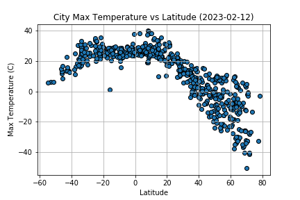

# Open Weather and Geoapify analyses
## Overview
The two jupyter notebooks in this repo ('WeatherPy' and 'VacationPy') contain the two parts to this analysis:
1. WeatherPy: An iterative API call to the [OpenWeatherAPI] (https://openweathermap.org/api) endpoint that retrieves real time weather data for 569 world locations from randomised geocoordinates and performs a regression analysis of factors such as 'Humidity', 'Temperature', 'Cloudiness' vs Latitude using matplotlib.pyplot. Images and .csv of location data saved at 'output_data'


2. VacationPy: An iterative API call to the [Geoapify](https://apidocs.geoapify.com/) 'places' endpoint that takes the geocoordinates in part 1 and searches the nearest hotels, filtering on weather parameters. Results are then mapped using the hvplot.pandas library.


This was completed as a module assignment for a data analysis bootcamp I am currently completing.

## Access and usage:
To clone this repo, use the following command:
```
git clone https://github.com/GPN87/openweather_geoapify_API_analyses.git
```

An API key is required to make and authorise requests to both endpoints, necessitating a free account registration.

Detailed information about request parameters are in the relevant API documentation linked above. This repo contains a gitignore file which hides the API keys used.